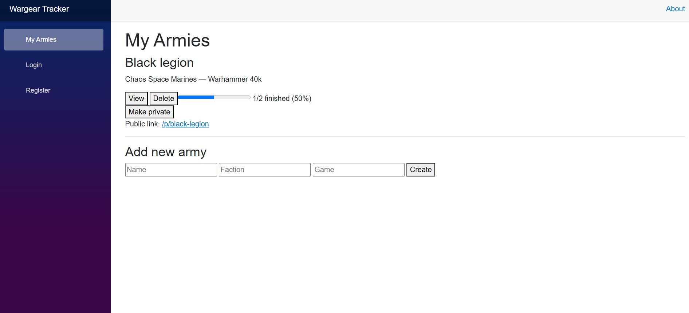
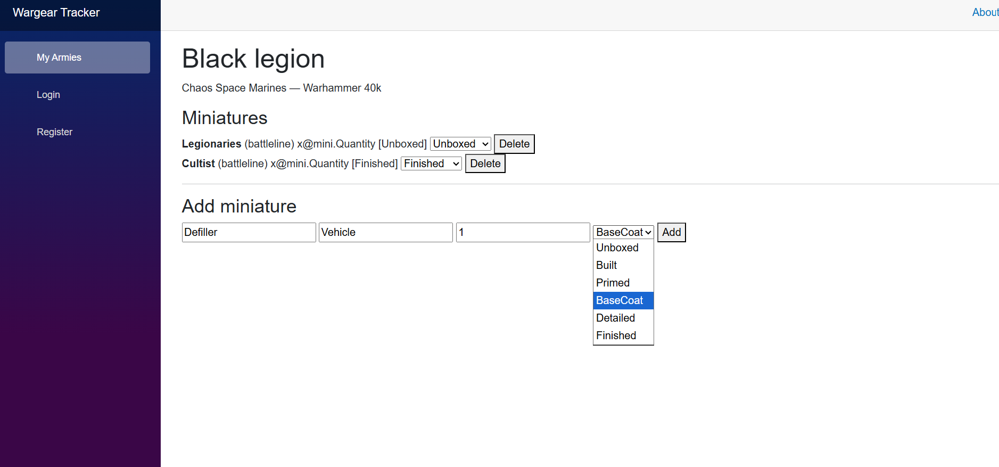
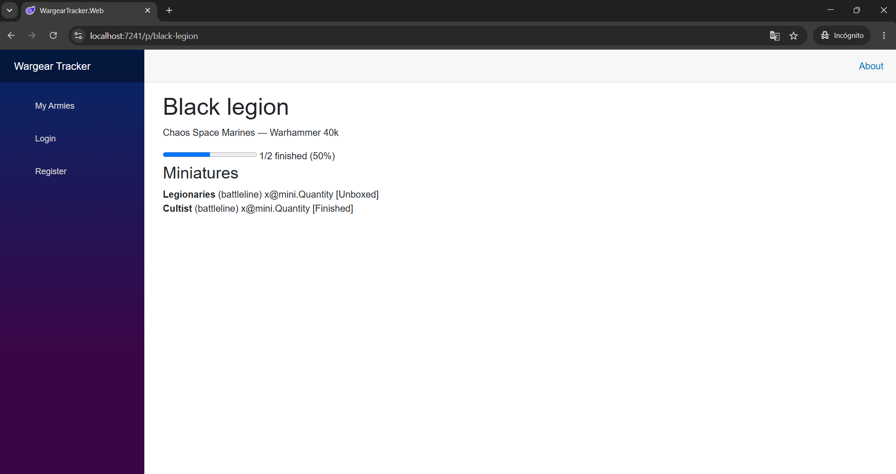

# Wargear Tracker

> Stop using Excel to track your pile of shame.

Wargear Tracker lets you manage your wargaming miniature collection and follow your painting progress army by army — from sprue to finished model. Share your progress with a public link, no login required for visitors.


<!-- 📸 CAPTURA 1: Pantalla de Armies.razor con 2-3 ejércitos creados, 
     mostrando la barra de progreso y el botón "Make public" -->


---

## What it does

- **Track your armies** — organize by game system and faction (40k, AoS, Bolt Action...)
- **Follow painting progress** per unit: Unboxed → Built → Primed → Base Coat → Detailed → Finished
- **Manage your collection** — add, update and delete units with full CRUD support
- **Share your progress** — make any army public and get a shareable link, no login needed to view
- Secure by default — JWT authentication on every personal endpoint

<!-- 📸 CAPTURA 2: Pantalla de ArmyDetail.razor con varias miniaturas, 
     el selector de PaintStatus visible y la barra de progreso -->


---

## Try it live

A live demo was deployed and verified on Railway:

**wargear-tracker-production.up.railway.app**

> The service is currently **paused** to avoid incurring costs on Railway's 
> free trial. If you'd like to see it live, [open an issue](https://github.com/TejeDesmoi/wargear-tracker/issues) 
> and I'll reactivate it temporarily.

<!-- 📸 CAPTURA 3: Pantalla pública /p/{slug} abierta en una ventana de incógnito, 
     para demostrar visualmente que funciona sin estar logado -->


---

## Getting started

### Requirements

- [.NET 10 SDK](https://dotnet.microsoft.com/download)
- [Docker Desktop](https://www.docker.com/products/docker-desktop/)

### Run with Docker (recommended)

```bash
git clone https://github.com/TejeDesmoi/wargear-tracker.git
cd wargear-tracker
docker compose up --build
```

API available at `http://localhost:8080`. Swagger UI at `/swagger`.

### Run the frontend

```bash
dotnet run --project src/WargearTracker.Web
```

Blazor app available at the URL shown in the terminal (typically `http://localhost:5241`).

### Run without Docker

```bash
# Requires a local PostgreSQL instance
dotnet ef database update \
  --project src/WargearTracker.Data \
  --startup-project src/WargearTracker.Api

dotnet run --project src/WargearTracker.Api
```

---

## API endpoints

| Method | Endpoint | Auth | Description |
|--------|----------|------|-------------|
| POST | `/api/auth/register` | No | Create a new account |
| POST | `/api/auth/login` | No | Get a JWT token |
| GET | `/armies` | Yes | List your armies |
| POST | `/armies` | Yes | Create a new army |
| GET | `/armies/{id}` | Yes | Get a single army |
| DELETE | `/armies/{id}` | Yes | Delete an army |
| PATCH | `/armies/{id}/visibility` | Yes | Make an army public or private |
| GET | `/armies/public/{slug}` | No | View a public army (shareable) |
| GET | `/armies/{armyId}/miniatures` | Yes | List miniatures in an army |
| POST | `/miniatures` | Yes | Add a miniature |
| PATCH | `/miniatures/{id}/status` | Yes | Update paint status |
| DELETE | `/miniatures/{id}` | Yes | Delete a miniature |

---

## Frontend routes

| Route | Description |
|-------|-------------|
| `/login` | Sign in |
| `/register` | Create an account |
| `/armies` | Your army dashboard |
| `/armies/{id}` | Army detail and miniature management |
| `/p/{slug}` | Public army page (no login required) |

---

## Project structure

```
wargear-tracker/
├── src/
│   ├── WargearTracker.Core/     # Entities, enums — no external dependencies
│   ├── WargearTracker.Data/     # EF Core DbContext, migrations
│   ├── WargearTracker.Api/      # ASP.NET Core Minimal API + Swagger + JWT
│   └── WargearTracker.Web/      # Blazor WebAssembly frontend
├── tests/
│   └── WargearTracker.Tests/
├── .github/
│   ├── workflows/                # CI pipeline
│   ├── ISSUE_TEMPLATE/
│   └── pull_request_template.md
├── Dockerfile
├── docker-compose.yml
└── README.md
```

---

## Roadmap

### Phase 1 — Local MVP ✅
- [x] Solution structure and project setup
- [x] Core domain entities (Army, Miniature, PaintStatus)
- [x] EF Core + SQLite + migrations
- [x] Army CRUD endpoints
- [x] Miniature CRUD endpoints
- [x] Swagger UI

### Phase 2 — Deploy and community ✅
- [x] JWT authentication (register + login)
- [x] Migrate to PostgreSQL + Docker
- [x] Public shareable link per army
- [x] Blazor WebAssembly frontend
- [x] CI with GitHub Actions
- [x] Deploy to Railway (verified, currently paused)

### Phase 3 — Community features
- [ ] Wahapedia integration (army list points)
- [ ] Spending tracker per army
- [ ] Community statistics
- [ ] Internal game/faction/miniature catalogue with dropdowns

---

## Built with

| Layer | Technology |
|-------|-----------|
| API | ASP.NET Core 10 — Minimal API |
| Auth | JWT Bearer + BCrypt |
| ORM | Entity Framework Core 10 |
| Database | PostgreSQL (Docker) |
| Frontend | Blazor WebAssembly |
| Docs | Swashbuckle / Swagger UI |
| CI/CD | GitHub Actions + Railway |

---

## Contributing

This is a personal project but issues and suggestions are welcome.  
If you find it useful, consider [supporting it on Ko-fi](https://ko-fi.com).

---

## License

MIT
